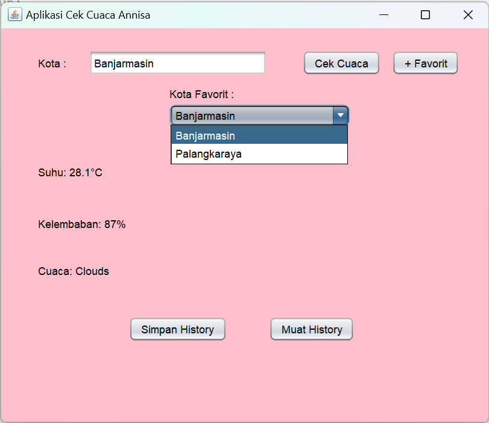

# CekCuacaSederhana
 Tugas 6 - Annisa (2210010581)
 
# Aplikasi Cek Cuaca Sederhana
 
Aplikasi Cek Cuaca Sederhana adalah aplikasi untuk ngecek cuaca menggunakan Key API openweathermap
# Keunggulan Aplikasi

- Cek Cuaca Sederhana: Aplikasi ini terdapat suhu, kelembaban, dan cuaca. Serta ada Simpan History dan Muat History

# Pembuat Aplikasi
 Annisa - 2210010581 - Tugas 6

# Fitur

Aplikasi ini menawarkan fitur:

Mengecek cuaca sederhana 
   Cek Cuaca Sederhana Suhu, Kelembaban, dan Cuaca

## Cara Menjalankan

1. Run File
2. Ketikkan Kota yang ingin kita input
3. Tekan Button Cek cuaca maka terlihat hasil suhu, kelembaban dan cuaca
4. Tekan Button Favorit jika ingin menjadikannya Favorit
5. Tekan Button Simpan History jika ingin Menyimpan datanya
6. Tekan Button Muat History jika ingin melihat riwayat history

# Demo

